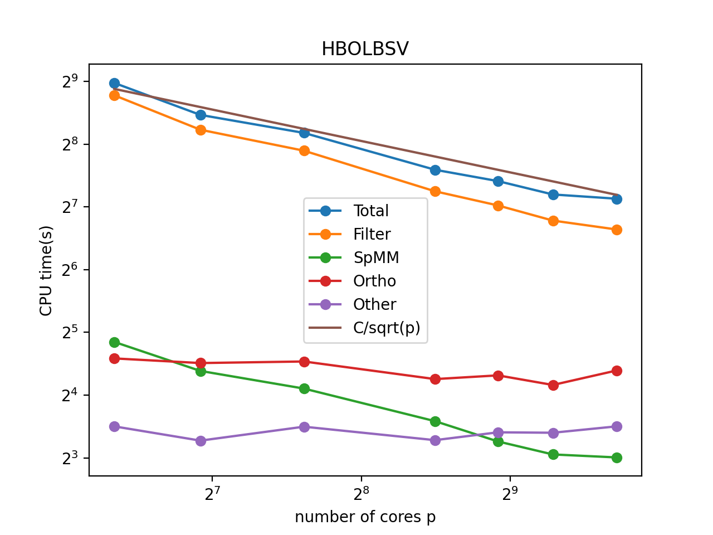

# DistributedLEVP.jl
Distributed solvers for evaluating smallest eigenpairs of large sparse symmetric matrices.

Distributed Block Chebyshev-Davidson method: bchdav_mpi.jl

For usages, please refer to ./src/bchdav_mpi.jl and the test file ./test/testBchdav_Graph.jl.

The scaling of the method and its component is summarized in the plot above. The matrix tested above is the normalized Laplacian of a static graph of 2*10^7 nodes in the high block overlap low block size variation category in http://graphchallenge.mit.edu/data-sets. 
